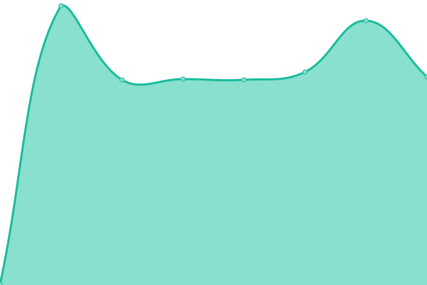

# [📈 Live Status](https://lprone.github.io/status): <!--live status--> **🟩 All systems operational**

This repository contains the open-source uptime monitor and status page for [Lucas Prone](http://lprone.com.ar), powered by [Upptime](https://github.com/upptime/upptime).

With [Upptime](https://upptime.js.org), you can get your own unlimited and free uptime monitor and status page, powered entirely by a GitHub repository. We use [Issues](https://github.com/lprone/status/issues) as incident reports, [Actions](https://github.com/lprone/status/actions) as uptime monitors, and [Pages](https://lprone.github.io/status) for the status page.

<!--start: status pages-->
<!-- This summary is generated by Upptime (https://github.com/upptime/upptime) -->
<!-- Do not edit this manually, your changes will be overwritten -->
<!-- prettier-ignore -->
| URL | Status | History | Response Time | Uptime |
| --- | ------ | ------- | ------------- | ------ |
|  [Lprone](https://www.lprone.com.ar) | 🟩 Up | [lprone.yml](https://github.com/lprone/status/commits/HEAD/history/lprone.yml) | 

 1150ms
     
 | 

<a href="https://lprone.github.io/status/history/lprone">100.00%</a>
    

|  [Grafana Neo](http://200.58.123.167:3457) | 🟩 Up | [grafana-neo.yml](https://github.com/lprone/status/commits/HEAD/history/grafana-neo.yml) | 

 812ms
     
 | 

<a href="https://lprone.github.io/status/history/grafana-neo">100.00%</a>
    

|  [Neo Viewer Index](http://neoclinica.ddns.net) | 🟩 Up | [neo-viewer-index.yml](https://github.com/lprone/status/commits/HEAD/history/neo-viewer-index.yml) | 

 887ms
     
 | 

<a href="https://lprone.github.io/status/history/neo-viewer-index">100.00%</a>
    

|  Neo Study View | 🟩 Up | [neo-study-view.yml](https://github.com/lprone/status/commits/HEAD/history/neo-study-view.yml) | 

 322ms
     
 | 

<a href="https://lprone.github.io/status/history/neo-study-view">100.00%</a>
    

<!--end: status pages-->

[**Visit our status website →**](https://lprone.github.io/status)

## 📄 License

- Powered by: [Upptime](https://github.com/upptime/upptime)
- Code: [MIT](./LICENSE) © [Anand Chowdhary](https://anandchowdhary.com), supported by [Pabio](https://pabio.com)
- Data in the `./history` directory: [Open Database License](https://opendatacommons.org/licenses/odbl/1-0/)
